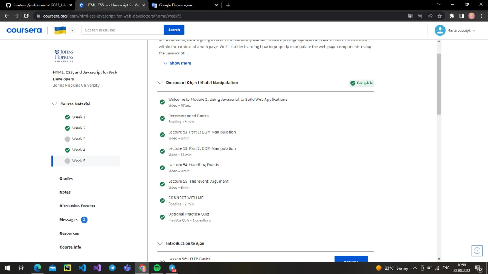
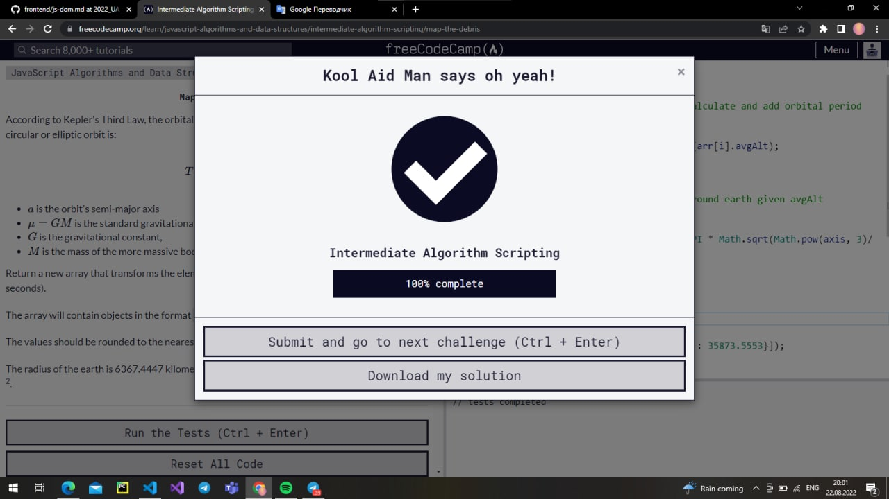
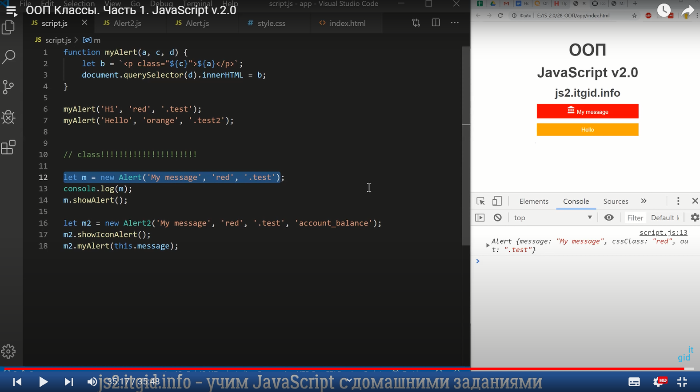
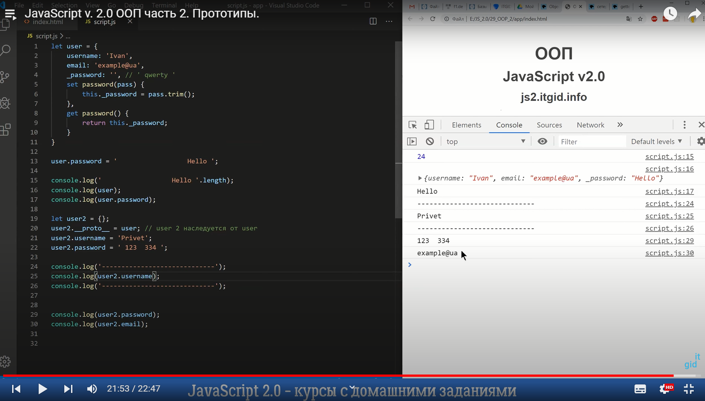
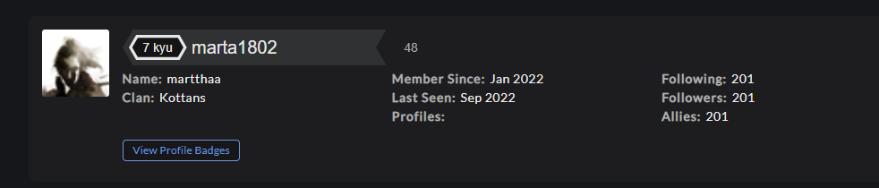

### :wave: *Hi there, I'm Martha and I wanna to share my experience in some passing courses with you:*
&nbsp;
# General
## Git Basics:
- __Introduction to Git and GitHub (2 week)__ [link to a course](https://www.coursera.org/learn/introduction-git-github)
>The course is awesome. I love the teaching pace of the tutor. The videos are short and informative with enough content. Short question during the lecture videos makes me alert and in fact makes me to go back and check the information again. Cheet sheets are given in every section of every week. Graded assignments are helpful, informative and covers all the contents covered in the week.

&nbsp;

&nbsp;
- __Learngitbranching__ [link to a course](https://learngitbranching.js.org/)
>The content was excellent. Branches, merging and other things were visualized and interactive. Here I completed exciting levels, watched step-by-step instruction on how to use Git powerful features. This course helped me better imagine the work of Git.

&nbsp;

\
*Сonclusion: I 've learned a lot of new things about Git that I'd never known before.*

&nbsp;

---
## Linux CLI, and HTTP:
- __Linux Survival (4 modules)__ [link to a course](https://linuxsurvival.com/linux-tutorial-introduction/)

>New thing: this course was extremely useful, because I have never used Linux before, I only knew the cd, ls commands.

>The thing that surprised me: File Security, File Permission, Redirecting output. Also it was especially interesting to practice checking processes and closing them through the "ps aux" command line.

>Things I'm going to use in the future: I think I'll definitely use these: cat, ls, mv, find, grep, kill, man, cd, mkdir, chmod, cp, rm, rmdir.

&nbsp;

\
*Сonclusion: really good online Linux lessons - they are interactive!*

&nbsp;
- __HTTP (part 1)__ [link to a article](https://code.tutsplus.com/uk/tutorials/http-the-protocol-every-web-developer-must-know-part-1--net-31177)

>New thing: found out about methods: head, trace, options. Also new for me was header formats.

>The thing that surprised me: the variation of request message formats.

>Things I'm going to use in the future: methods: POST, GET, PUT.

&nbsp;
- __HTTP (part 2)__ [link to a article](https://code.tutsplus.com/uk/tutorials/http-the-protocol-every-web-developer-must-know-part-2--net-31155)

>New thing: persistent and parallel connections, Proxy and Digest Authentication, private and public hashing, Fat Urls.

>The thing that surprised me: interesting hashing functionality.

>The thing I'm going to use in the future: Identification and authentication

&nbsp;

---
## Git Collaboration:

- __Introduction to Git and GitHub ( weeks 3, 4 )__ [link to a course](https://www.coursera.org/learn/introduction-git-github)

>New thing: that rebasing is an alternative to git merge.

>The thing that surprised me: Solving Conflicts.

>Something I'm going to use in the future: Git Fork and Pll Request.

&nbsp;

\
*Сonclusion: Excellent course I really learned a lot about git and GitHub during this course. I like most others have used git and Github before but it wasn't so clear. This course gives a person a really great foundation in a well-understood manner.*

&nbsp;
- __Learngitbranching__ [link to a course](https://learngitbranching.js.org/)

>New thing: git fetch.

>The thing that surprised me: extended arguments git push.

>Things I'm going to use in the future: clone, fetch, merge, pull, push rebase, checkout.

&nbsp;

\
*Сonclusion: The content was excellent. Branches, merging, and other things were visualized and interactive. Here I completed exciting levels, watched step-by-step instruction on how to use Git powerful features.Now, I better understand how git works.*

&nbsp;
# Front-End Basics
## Intro to HTML & CSS:
- __Intro to HTML & CSS ( weeks 1, 2 )__ [link to a course](https://www.coursera.org/learn/html-css-javascript-for-web-developers)

>New thing: I already knew things from this 2 weeks, but it was useful for repetition.

>The thing that surprised me: Difficult to say cause most of information I've known till this course.

>Something I'm going to use in the future: I will use html and css to building web-pages.

&nbsp;
<

&nbsp;
- __Learn HTML(Eng)__ [link to a course](https://www.codecademy.com/learn/learn-html)

>New thing: 'embed' tag for media files, 'controls' for video, 'figure', 'figcaption'.

>The thing that surprised me: It was quite interesting to work with table and forms.

>Something I'm going to use in the future: I will use html to build web-pages.

&nbsp;

&nbsp;
- __Learn CSS(Eng)__ [link to a course](https://www.codecademy.com/learn/learn-css)

>New thing: '@font-face' property.

>The thing that surprised me: Difficult to say cause most of information I've known till this course.

>Something I'm going to use in the future: I will use css to build beautiful web-pages.

&nbsp;

&nbsp;
## Responsive Web Design:
- __Responsive web design basics__ [link to article](https://web.dev/i18n/en/responsive-web-design-basics/)

>New thing: using CSS media queries for responsiveness, any-hover, any-pointer. Also discover for myself that classic readability theory suggests that an ideal column should contain 70-80 characters per line(about 8 to 10 words in English).

>The thing that surprised me: nothing.

>Something I'm going to use in the future: viewport, flexbox, Grid Layots, @media.

&nbsp;
- __FLEXBOX. Вчимося верстати на флексах__ [link to video](https://www.youtube.com/playlist?list=PLM6XATa8CAG5mPV60dMmjMRrHVW4LmV2x)

>New thing: align-self, flex-basis, flex-grow, flex-shrink.

>The thing that surprised me: In general, it is interesting to use FLEXBOX at work.

>Something I'm going to use in the future: align-items, flex-direction, flex-wrap, align-content.

&nbsp;

&nbsp;
- __Flexbox Froggy__ [link to game](http://flexboxfroggy.com/#uk)

*Сonclusion: interesting interactive game for practice.*

&nbsp;
- __CSS Grid Layout__ [link to video](https://www.youtube.com/playlist?list=PLM6XATa8CAG5pXQrW_kDaeZb_uIAMNZIm)

>New thing: grid-template-columns, grid-template-areas, grid-auto-rows, grid-auto-columns, grit-auto-flow.

>The thing that surprised me: I rarely used Grid before, but I founded out that using it make creating a web page a lot easier.

>Something I'm going to use in the future: grid-column-start, grid-column-end, grid-column.

&nbsp;
- __Grid Garden__ [link to video](http://cssgridgarden.com/)

*Сonclusion: interesting interactive game for practice.*

&nbsp;
## HTML & CSS Practice:
[Demo](https://martthaa.github.io/sweetPopUp/) /
[Code](https://github.com/martthaa/sweetPopUp)

&nbsp;
## JS Basics:
*Сonclusion: it was extremely interesting and fun. I learned new things, such as reduce() and filter(), which I will definitely use in the future.*

&nbsp;
## Document Object Model:
*Сonclusion: in fact, I already knew a lot about DOM but remembering things and practicing them was useful for me. I also really liked working with a practical task, I faced with challenges, I put in the effort and solved these problems successfully.*

### Practice Sidebar Menu

[Code](https://github.com/martthaa/Music-SideBar-Menu) |
[Demo](https://martthaa.github.io/Music-SideBar-Menu/)

&nbsp;
## Building a Tiny JS World:

[DEMO]( https://martthaa.github.io/a-tiny-JS-world/) | [Code Base](https://github.com/martthaa/a-tiny-JS-world)

&nbsp;
## Object-Oriented JavaScript:

Classic Frogger Game:
[DEMO](https://martthaa.github.io/frontend-nanodegree-arcade-game/) | [CODE BASE](https://github.com/martthaa/frontend-nanodegree-arcade-game)

I learned a lot about:

- Scopes;
- Closures;
- this keyword;
- Object Decorator Pattern;
- Functional Classes;
- Prototypal Classes;
- Pseudoclassical Patterns;
- Superclass and Subclasses;

I completed frogger game. It was difficult and unobvious task for me.

I returned to codewars service after a long period. Now I am better prepared to solve tasks (katas) and achieved new levels (kuys). I plan to continue the task solving at this service at future.

